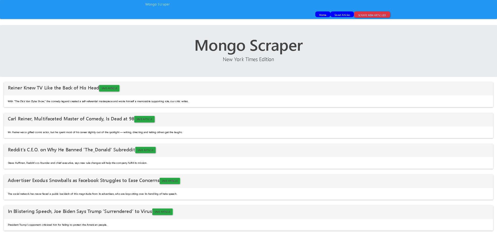

# NYT-Scrape

This app will scrape articles from the New York Times and allow users to save articles and add notes to their saved articles.

---

## TECHNOLOGIES USED

- [Node.js](https://nodejs.org/en/docs/) _an asynchronous event-driven JavaScript runtime, Node.js is designed to build scalable network applications_
- [express](https://www.npmjs.com/package/express) _web framework for node_
- [handlebars](https://www.npmjs.com/package/handlebars) _HTML template_
- [mongodb](https://www.mongodb.com/) _database_

---

## PREREQUISITS

- [popper](https://www.npmjs.com/package/popper) _npm install popper_
- [axios](https://www.npmjs.com/package/axios) _npm install axios_
- [body-parser](https://www.npmjs.com/package/body-parser) _npm install body-parser_
- [bootbox](https://www.npmjs.com/package/bootbox) _npm install bootbox_
- [cheerio](https://www.npmjs.com/package/cheerio) _npm install cheerio_
- [express](https://www.npmjs.com/package/express) _npm install express_
- [express-handlebars](https://www.npmjs.com/package/express-handlebars) _npm install express-handlebars_
- [mongoose](https://www.npmjs.com/package/mongoose) _npm install mongoose_

---

## PRODUCT FEATURES

The user will click on the scrape new articles button to get articles from the New York Times. Those articles will then appear on the home page. The user then has the option of saving any of those articles. At the top of the page is a button for the saved articles, when clicked this will take the user to a page where all saved articles are. The user will then have the option to add notes to any article they have saved or they can delete the article from the saved list.

---

## LINKS

- Github repo: https://github.com/KEHeidel/NYT-Scrape
- Deployed link: https://nytscraper-kh.herokuapp.com/

---

## AUTHOR

- [Kortnie Heidel](mailto:kortnie.evans@gmail.com)